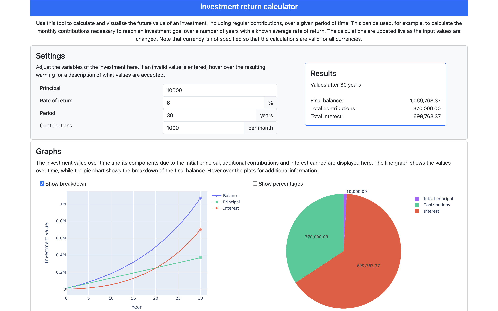

# Creating an Interactive Investment Dashboard



Creating an interactive investment dashboard involved building a Plotly Dash application that calculates the value of investments over time. The dashboard accepts user inputs for initial investment amount, interest rate, investment period, and regular contributions, dynamically updating the resulting projections and visualisations.

The dashboard is containerised using Docker and deployed on Render, allowing users to access it online. I added features such as input validation and hover text for time series data to give a good user experience.

The dashboard is available at [https://investment-return-dashboard.onrender.com](https://investment-return-dashboard.onrender.com), which may take a minute or two to spin up as I'm using the free tier on Render. Unfortunately, an issue on Render sometimes prevents the app from cold starting. In that case, the source code is available on [GitHub](https://github.com/georgeholt1/investment-dash), which also contains instructions for running the app locally.

## High-Level Overview of the Dashboard

The dashboard enables users to:

1. **Input investment parameters:** Users can enter the initial amount, interest rate, investment period, and regular contribution amount.
2. **Visualise results:**
   - **Line Graph:** Shows the investment value growth over time, including breakdowns by principal, contributions, and interest.
   - **Pie Chart:** Displays the final distribution of the investment value across principal, contributions, and interest.
3. **Interact with the elements:** The dashboard dynamically updates based on user input and provides additional information through tooltips and hover texts.

## Formatting Invalid Text Inputs

### Problem:
Invalid inputs in text entry fields caused the dashboard to malfunction without any warning.

### Solution:
I addressed the issue by implementing custom CSS styling to highlight invalid entries:

```css
.invalid-or-empty {
  border-color: #dc3545;
  padding-right: calc(1.5em + 0.75rem);
  background-image: url("data:image/svg+xml,%3csvg xmlns='http://www.w3.org/2000/svg' viewBox='0 0 12 12' width='12' height='12' fill='none' stroke='%23dc3545'%3e%3ccircle cx='6' cy='6' r='4.5'/%3e%3cpath stroke-linejoin='round' d='M5.8 3.6h.4L6 6.5z'/%3e%3ccircle cx='6' cy='8.2' r='.6' fill='%23dc3545' stroke='none'/%3e%3c/svg%3e");
  background-repeat: no-repeat;
  background-position: right calc(0.375em + 0.1875rem) center;
  background-size: calc(0.75em + 0.375rem) calc(0.75em + 0.375rem);
  outline: none;
}
```

The `update_input_style` callback applies this CSS class to indicate invalid inputs:

```python
@app.callback(
    Output("input-initial-amount", "className"),
    Output("input-rate-of-return", "className"),
    Output("input-investment-period", "className"),
    Output("input-contributions", "className"),
    Input("input-initial-amount", "value"),
    Input("input-rate-of-return", "value"),
    Input("input-investment-period", "value"),
    Input("input-contributions", "value"),
)
def update_input_style(input_amount, input_return, input_period, input_contributions):
    inputs = [input_amount, input_return, input_period, input_contributions]
    return ["invalid-or-empty" if x is None else "" for x in inputs]
```

## Year-Month Hover Text for Time Series Data

### Problem:
When plotting the "year" on the x-axis, Plotly displayed decimal years (e.g., 3.25 for year 3, month 3), which was not user-friendly.

### Solution:
I created an additional DataFrame column with formatted year-month labels:

```python
df["year_month"] = df["period"].apply(
    lambda x: (
        "Year 0, Month 0"
        if x == 0
        else f"Year {x // 12}, Month {x % 12 if x % 12 != 0 else 12}"
    )
)
```

Then, I generated hover text labels for the line graph:

```python
def generate_hovertext(df: pd.DataFrame) -> pd.Series:
    hovertext = df.apply(lambda x: f"<b>{x['year_month']}</b><br>Balance: {x['value']:,.2f}", axis=1)
    return hovertext

fig.add_trace(
    go.Scatter(
        x=df["year"],
        y=df["value"],
        hovertext=generate_hovertext(df),
    )
)
```

There is additional logic in `app.py` that improves formatting and alignment.

## Deployment Process

The application was deployed using Render, which offers free containerised web hosting.

### Steps:

1. **Containerise the Application:** I created a Dockerfile to define the container environment.

    ```dockerfile
    FROM continuumio/miniconda3

    WORKDIR /usr/src/app

    COPY . .

    RUN conda env create -f conda_env.yml

    SHELL ["conda", "run", "-n", "investment-dash", "/bin/bash", "-c"]

    EXPOSE 8000

    ENTRYPOINT ["conda", "run", "--no-capture-output", "-n", "investment-dash", "gunicorn", "-b", "0.0.0.0:8000", "app:server"]
    ```

2. **Host on GitHub:** Make the repository public to allow Render to pull the application for deployment.
   
3. **Deploy on Render:** Use the Render dashboard to create a new web service. Render pulls the GitHub repository and builds the containerised application.

## Conclusion

Building and deploying the investment dashboard was a multifaceted project involving Python, Plotly Dash, Docker, and Render. The result is a hopefully useful tool for calculating and visualising projected investment value. The deployment process enables the application to be deployed online.