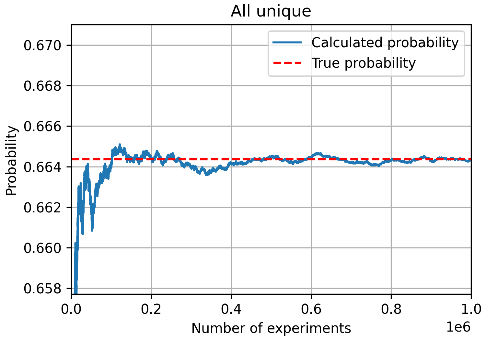
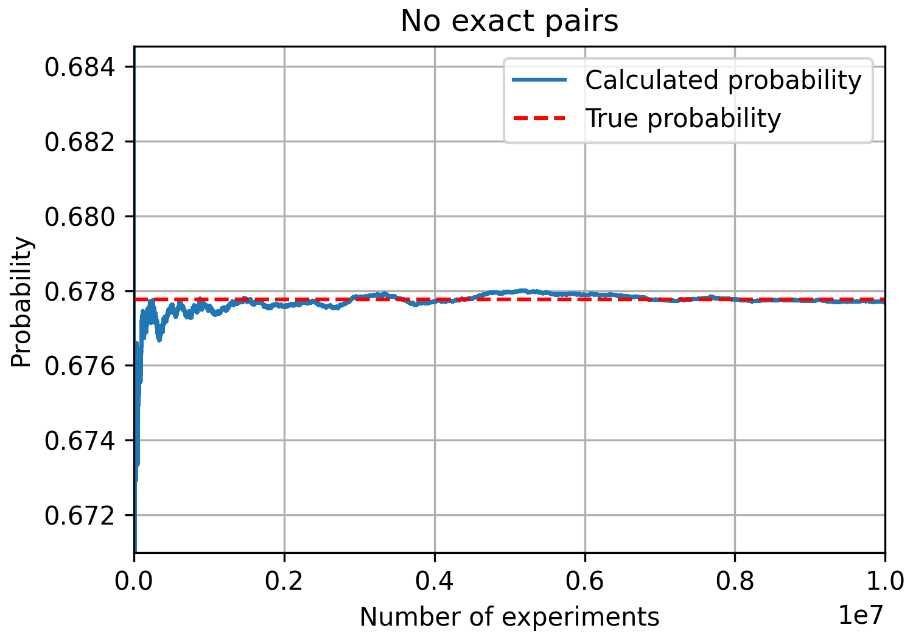

I recently came up with a probability puzzle while watching an episode of [Taskmaster](https://www.channel4.com/programmes/taskmaster).

> Five contestants select a letter from the alphabet simultaneously and uniformly. What is the probability that there are no pairs?

On the surface, this problem seems simple. However, slightly tweaking the formulation can lead to a more interesting puzzle:

> `n` contestants select an item from `m` possible unique items uniformly and with replacement. What is the probability that there are *exactly* no pairs?

In this post, I delve into both formulations, deriving the probabilities analytically and running [Monte Carlo](https://en.wikipedia.org/wiki/Monte_Carlo_method) simulations to validate the results.

Accompanying Python code for the simulations can be found in the [GitHub repository](https://github.com/georgeholt1/exact-pairs-probability-monte-carlo).

## All unique: The first formulation

The puzzle's initial formulation, "All unique," is as follows:

> Five contestants select a letter from the alphabet simultaneously and uniformly. What is the probability that there are no pairs?

One interpretation of this formulation asks, "What is the probability that all chosen letters are different?" Given that each contestant has an equal probability of selecting any of the 26 letters, the probability of each contestant's choice is $ \frac{1}{26} $.

Any specific arrangement of choices has a probability of: $ \frac{1}{26^5} $.

For five contestants, we need to consider the number of permutations where all choices are unique. This is simply the number of ways to choose five letters from 26, which is given by the binomial coefficient: $ \frac{26!}{(26 - 5)!} $.

To find the total probability, the common probability is multiplied by the number of permutations:

$$ P( \text{all letters are different} ) = \frac{26!}{26^5 \cdot 21!} \approx 0.664. $$

### Monte Carlo simulation: A fun overkill

Although deriving the probability analytically for this formulation is straightforward, building a framework to run Monte Carlo simulations will be useful when generalising to more challenging formulations.

Following is the docstring for a reusable Python class for performing these probability experiments written in the general form for $n$ participants choosing from $m$ items.

```python
class ProbabilityExperiment:
    """
    Base class for performing probability experiments.

    Parameters
    ----------
    n : int
        Number of participants.
    m : int
        Number of items.
    k : int
        Number of experiments.
    seed : int
        Seed for the random number generator.

    Attributes
    ----------
    rng : numpy.random.Generator
        Random number generator.
    results : list
        List to store experiment results.

    Methods
    -------
    run_experiment()
        To be implemented by child classes. Performs a single experiment
        and returns True if the outcome is the case being tested and
        False otherwise.
    simulate_probability()
        Runs multiple experiments and calculates the probability of the
        case being tested.
    calculate_true_probability()
        To be implemented by child classes. Calculates the true probability
        of the case being tested (if known).
    plot_results()
    """
```

The class is intended to be extended with calculations for specific formulations of the problem. The `run_experiment()` and `plot_results()` methods are common to all formulations so are implemented in the base class, while the `simulate_probability()` and `calculate_true_probability()` methods are to be implemented by child classes.

For the "All unique" formulation, the `ProbabilityExperiment` class is extended as follows:

```python
class AllUnique(ProbabilityExperiment):
    def run_experiment(self):
        """
        Performs a single experiment to check if all participants choose
        different items.

        Returns
        -------
        bool
            True if all participants choose different items, False
            otherwise.
        """
        choices = self.rng.integers(1, self.m + 1, self.n)
        unique_choices = np.unique(choices)
        return len(unique_choices) == self.n

    def calculate_true_probability(self):
        """
        Calculates the true probability of all participants choosing
        different items.

        Returns
        -------
        float
            True probability.
        """
        self.true_probability = math.factorial(self.m) / (
            self.m**self.n * math.factorial(self.m - self.n)
        )
        return self.true_probability
```

Running the simulation for this formulation with five participants choosing from the alphabet ($n=5$ and $m=26$) for $k = 10^6$ steps yields a simulated probability of approximately 0.664, matching the analytical result.



## No exact pairs: A more interesting formulation

The second formulation is more interesting:

> `n` contestants select an item from `m` possible unique items uniformly and with replacement. What is the probability that there are *exactly* no pairs?

Here, "exactly no pairs" means that no two contestants choose the same item, but more than two choosing the same item is allowed. For example:
- `[A, B, C, D, E]` is allowed
- `[A, A, C, D, E]` is not allowed
- `[A, A, A, D, E]` is allowed
- `[A, A, B, B, E]` is not allowed

### Monte Carlo simulation for no exact pairs

The following again extends the `ProbabilityExperiment` base class to define a simulation for this formulation:

```python
class NoExactPairs(ProbabilityExperiment):
    """
    Child class to perform probability experiments and calculate
    probabilities for the case where there are no exact pairs. That is,
    no two participants choose the same item, but there may be groups of
    three or more participants choosing the same item.
    """
    
    def run_experiment(self):
        """
        Performs a single experiment to check if there are any exact
        pairs.

        Returns
        -------
        bool
            True if there are any exact pairs, False otherwise.
        """
        choices = self.rng.integers(1, self.m + 1, self.n)
        _, counts = np.unique(choices, return_counts=True)
        return np.all(counts != 2)
```

Simple.

### Derivation of the probability

Deriving the probability for this formulation is more challenging.

Let $A_i$ be the event that the $i$th item is selected exactly twice. The probability of each event $A_i$ is:

$$ P(A_i) = \binom{n}{2} \left( \frac{1}{m} \right)^2 \left( \frac{m-1}{m} \right)^{n-2} $$

Similarly, the probability that the $i$th and $j$th items are selected exactly twice is:

$$ P(A_i \cap A_j) = \binom{2}{2,2} \left( \frac{1}{m} \right)^4 \left( \frac{m-2}{m} \right)^{n-4} $$

Generalizing for $k$ items being selected exactly twice:

$$\begin{multline}
P(A_1 \cap A_2 \cap \ldots \cap A_k) = \\
\binom{2}{2,2,\ldots,2} \left( \frac{1}{m} \right)^{2k} \left( \frac{m-k}{m} \right)^{n-2k}
\end{multline}$$

Using the inclusion-exclusion principle:

$$\begin{align}
P(\text{at least 1 exact pair}) &= \sum_{i=1}^m P(A_i) \\
&- \sum_{1 \le i < j \le m} P(A_i \cap A_j) \\
&+ \sum_{1 \le i < j < k \le m} P(A_i \cap A_j \cap A_k) \\
&- \ldots
\end{align}$$

Taking the complement:

$$\begin{multline}
P(\text{no exact pairs}) = 1 - \sum_{k=1}^{\min(m, \lfloor n/2 \rfloor)} \\
(-1)^{k+1} \sum_{1 \le i_1 < i_2 < \ldots < i_k \le m} P(A_{i_1} \cap A_{i_2} \cap \ldots \cap A_{i_k})
\end{multline}$$

In Python, this can implemented as follows:

```python
def calculate_true_probability(self):
    """
    Calculates the true probability of no exact pairs.

    Returns
    -------
    float
        True probability
    """

    def multinomial_coefficient(*args):
        """Calculate the multinomial coefficient."""
        return math.factorial(sum(args)) // math.prod(
            math.factorial(x) for x in args
        )

    def p_a_i_1_to_k(k):
        """Calculate the probability of having exactly k pairs."""
        return (
            multinomial_coefficient(*([2] * k + [self.n - 2 * k]))
            * (1 / self.m) ** (2 * k)
            * ((self.m - k) / self.m) ** (self.n - 2 * k)
        )

    min_k = min(self.m, self.n // 2)
    sum_terms = 0

    for k in range(1, min_k + 1):
        combs = combinations(range(self.m), k)
        sum_k_terms = sum(p_a_i_1_to_k(k) for _ in combs)
        sum_terms += (-1) ** (k + 1) * sum_k_terms

    p_at_least_one_exact_pair = sum_terms
    p_no_exact_pairs = 1 - p_at_least_one_exact_pair

    self.true_probability = p_no_exact_pairs
    return self.true_probability
```

### Simulation results

Running the simulation for this formulation with five participants choosing from the alphabet ($n=5$ and $m=26$) for $k = 10^7$ steps yields a simulated probability of approximately 0.678, matching the analytical result.



## Final thoughts

The Taskmaster-inspired probability puzzle led to two interesting formulations. The first, "All unique," was straightforward to solve analytically and through simulation. This case was a useful test bed to build and validate the framework for the Monte Carlo simulations. The second, "No exact pairs," required a more complex analytical solution but was still solvable, and was much simpler to implement as a Monte Carlo simulation.

The combination of analytical and simulation methods provided a robust solution to both formulations, and shows that simulation can be a powerful tool in probabilistic problem-solving.

[This GitHub repository](https://github.com/georgeholt1/exact-pairs-probability-monte-carlo) contains the full Python code for the simulations.