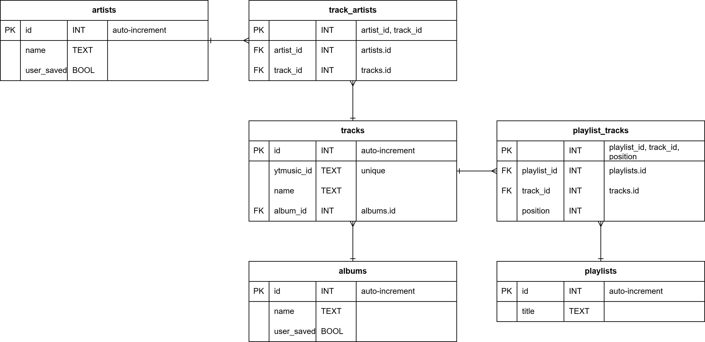
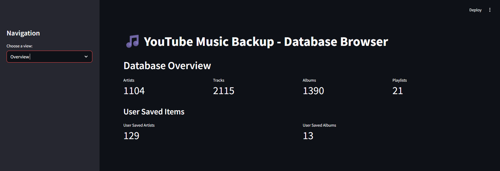
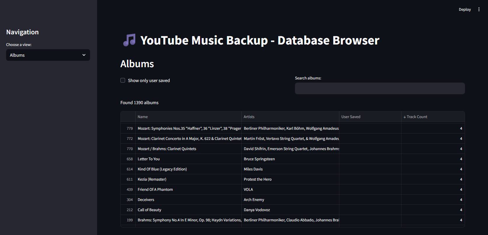

In this post, I'll introduce **yt-music-backup (YTMB)**, a Python application I developed to create local backups of my YouTube Music library. YTMB automates the process of retrieving playlists, tracks, albums, artists, and subscriptions, and stores them in a structured SQL database for further analysis or offline reference. Additionally, it includes a Streamlit interface for visual exploration of the library data.

## Use Case and Motivation

YouTube Music does not provide a native way to export or back up user library data. As a user with an ever-growing collection on YouTube Music, I needed a reliable method to archive my library. YTMB was built to:

- **Automate data extraction** from YouTube Music.
- **Store the library in an SQL database**.
- **Support easy querying and analysis** of the music library.
- **Facilitate visualisation** via a Streamlit web UI.

## Scraping the YouTube Music Library

YTMB uses the [ytmusicapi](https://github.com/sigma67/ytmusicapi) Python library to authenticate and retrieve library contents from YouTube Music. Authentication is handled via user OAuth credentials—these are referenced via environment variables and a configuration file.

**Functions are provided to retrieve:**

- All playlists (`get_all_playlists`)
- All tracks in a playlist (`get_playlist_tracks`)
- All user albums (`get_all_albums`)
- All user artists and subscriptions


## Data Storage and Database Design

All extracted music library data is stored in a **SQLite database**, leveraging [SQLAlchemy](https://www.sqlalchemy.org/) for [ORM mapping](https://en.wikipedia.org/wiki/Object%E2%80%93relational_mapping). The schema is designed to capture relationships between artists, tracks, albums, and playlists, supporting rich queries and efficient lookups.

**Database Entity Relationship Diagram (ERD)**  


Schema overview:

- **Artist:** id, name, user_saved
- **Track:** id, name, ytmusic_id, album_id
- **Album:** id, name, user_saved
- **Playlist:** id, title
- **TrackArtist:** (association table, many-to-many: Track <-> Artist)
- **PlaylistTrack:** (association table, many-to-many: Playlist <-> Track, with position)

**SQLAlchemy ORM models (snippet):**

```python
from sqlalchemy import (
    Column, Integer, String, Boolean, ForeignKey, UniqueConstraint
)
from sqlalchemy.ext.declarative import declarative_base
from sqlalchemy.orm import relationship

Base = declarative_base()

class Artist(Base):
    __tablename__ = "artists"
    id = Column(Integer, primary_key=True)
    name = Column(String, nullable=False)
    user_saved = Column(Boolean, nullable=False, default=False)
    tracks = relationship(
        "TrackArtist",
        back_populates="artist",
        cascade="all, delete-orphan"
    )

class Track(Base):
    __tablename__ = "tracks"
    id = Column(Integer, primary_key=True)
    name = Column(String, nullable=False)
    ytmusic_id = Column(String, unique=True, nullable=False)
    album_id = Column(Integer, ForeignKey("albums.id"), nullable=False)
    artists = relationship(
        "TrackArtist",
        back_populates="track",
        cascade="all, delete-orphan"
    )
    playlist_tracks = relationship(
        "PlaylistTrack",
        back_populates="track",
        cascade="all, delete-orphan"
    )

# (other models)
```

## Database Operations with SQLAlchemy

YTMB implements its database logic using SQLAlchemy ORM. The main operations include:

- **Storing playlists, tracks, albums, and artists** (with deduplication checks).
- **Managing many-to-many relationships** via association tables.
- **Synchronising the database**: removing entities that no longer exist in the online library.

Example of storing tracks from a playlist:

```python
def store_track_from_playlist(
    session, playlist_table_id, track_data, track_position_in_playlist
):
    """Store track and relationships from a playlist in the database.

    Checks and stores track and related artist/album information in the
    database, and handles PlaylistTrack relationships.

    Parameters
    ----------
    session : sqlalchemy.orm.Session
    playlist_table_id : int
        The unique integer ID of the playlist in the playlists tabls of the
        database.
    track_data : dict
        Dictionary containing track information, must include `videoId`,
        `title`, `album`, and `artists`.
    track_position_in_playlist : int
        Position of the track within the playlist.
    """
    # Check if track exists
    track = session.query(Track).filter_by(ytmusic_id=track_data["videoId"]).first()

    if not track:
        album = store_album_from_track_data(session, track_data)

        # Create new track
        track = Track(
            ytmusic_id=track_data["videoId"],
            name=track_data["title"],
            album_id=album.id,
        )
        session.add(track)

        # Handle artists
        for artist_data in track_data["artists"]:
            artist = store_artist(session, artist_data["name"])

            # Create TrackArtist relation if it doesn't exist
            if (
                not session.query(TrackArtist)
                .filter_by(artist_id=artist.id, track_id=track.id)
                .first()
            ):
                track_artist = TrackArtist(artist_id=artist.id, track_id=track.id)
                session.add(track_artist)

    # Handle PlaylistTrack relationship
    if (
        not session.query(PlaylistTrack)
        .filter_by(playlist_id=playlist_table_id, track_id=track.id)
        .first()
    ):
        playlist_track = PlaylistTrack(
            playlist_id=playlist_table_id,
            track_id=track.id,
            position=track_position_in_playlist,
        )
        session.add(playlist_track)

    try:
        session.commit()
    except IntegrityError:
        session.rollback()
```

**Cleanup functions** (e.g., remove playlists, artists, albums, tracks) are similarly implemented using SQLAlchemy session queries, allowing the local database to mirror the current state of the upstream YouTube Music library.

## Automatic Creation of the `ytmb-all` Playlist

A unique feature of YTMB is the automatic generation of a special "ytmb-all" playlist. This playlist acts as a comprehensive collection containing every track currently found in the user's library database, making it easy to listen to the entire library (a feature not available in YouTube Music itself) or transfer it elsewhere.

**How the ytmb-all Playlist Works**

- **Detection and Creation:**  
  During each backup run, YTMB checks if a playlist named `ytmb-all` already exists in the YouTube Music account. If it does not, YTMB creates it using the ytmusicapi. Whether or not the `ytmb-all` playlist is handled during the backup is controlled by a flag passed to the main script.

- **Synchronizing Contents:**  
  YTMB compares the `ytmb-all` playlist's contents with all tracks currently stored in the backup database. Any tracks present in the database but missing from the playlist are added, ensuring that the playlist always mirrors the full local library.

- **Idempotency:**  
  The process is designed to be idempotent: running it multiple times keeps the playlist up to date with minimal API calls and without duplicate entries.

- **Writing to the YouTube Music Account:**
  The script uses the ytmusicapi library to write changes to the `ytmb-all` playlist back to the YouTube Music account.

## Database Visualisation with Streamlit

To facilitate interactive exploration, YTMB ships with a [Streamlit](https://streamlit.io/) application (`streamlit_app.py`) that connects directly to the backup database and displays summaries and detailed records of the library.

Key Streamlit features:

- **Overview dashboards** for counts of artists, albums, tracks, playlists, and user-saved items.
- **Interactive tables** for browsing and searching artists, albums, tracks, and playlists.
- **Drilldown views**: Select an artist/album/playlist to inspect their related tracks, appearances, or contributing artists.

**UI:**

- Sidebar navigation for different entity views.
- Search and filtering controls for narrowing results.
- DataFrames rendered using `st.dataframe`, with details available for selected entries.

**Screenshots**

Landing page:


Albums view:


## Running YTMB

After setting environment variables and configuring OAuth credentials, backup and visualise the YouTube Music library as follows:

```shell
# Backup library to SQL database
poetry run ytmb

# Launch the Streamlit database browser
poetry run streamlit run streamlit_app.py
```

## Conclusion

The YTMB project demonstrates how Python, SQLAlchemy, ytmusicapi, and Streamlit can be orchestrated for robust, user-friendly backups of online YouTube Music libraries. The database and web UI make it straightforward to analyse trends, find duplicates, or audit library changes over time.

YTMB is available [on GitHub](https://github.com/georgeholt1/yt-music-backup).

---

*If you found this project interesting or have questions, please feel free to reach out using any of the methods in my [Contact page](/contact).*

```